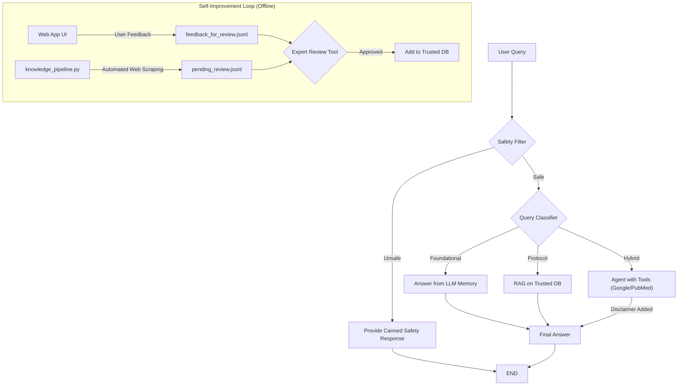

# rmk-langgraph

# Adaptive Medical Hybrid RAG Agent

A smart, self-improving AI for Weight Management & Body Composition, built with LangGraph and Gemini.

This project implements the principles of the "Adaptive-RAG" paper to create an intelligent agent that dynamically adapts its strategy for answering questions. Instead of using a single, rigid workflow, it classifies incoming queries and routes them to the most appropriate tool, whether that's its internal memory, a trusted knowledge base, or live web search.

The system is designed for the high-stakes domain of medical knowledge, specifically focusing on obesity, weight loss, and muscle gain. It includes a multi-layered self-improvement loop with human-in-the-loop verification to ensure the knowledge base remains accurate, safe, and up-to-date.

## Core Features

-   **Adaptive RAG Architecture:** Built with LangGraph, the agent classifies queries into `foundational`, `protocol`, or `hybrid` and uses the best strategy for each.
-   **Multi-Tool Capability:** The agent can choose between using Google Search for general or recent topics and a specialized PubMed API tool for deep scientific research.
-   **Human-in-the-Loop Self-Improvement:** The system learns from both user feedback and a semi-automated knowledge pipeline, but a human expert provides the final approval before new knowledge is added to the trusted database.
-   **Safety First:** Includes a safety filter to identify and block harmful queries, providing a safe user experience.
-   **Configurable & Maintainable:** Key settings like the LLM model name are managed in a `.env` file, allowing for easy experimentation and upgrades.

## Architecture & Workflow

The application's logic is orchestrated by a LangGraph state machine, which provides a clear, robust, and adaptable workflow.



## Tech Stack

-   **Orchestration:** LangChain & LangGraph
-   **LLM:** Google Gemini (configurable)
-   **Frontend:** Streamlit
-   **Vector Database:** ChromaDB
-   **Embeddings:** HuggingFace Sentence Transformers (`all-MiniLM-L6-v2`)
-   **Medical Search:** BioPython (for Entrez/PubMed API)

---

## How-To Guide: Setup and Usage

Follow these steps to get the application running on your local machine.

### 1. Prerequisites

-   Python 3.9+
-   Git

### 2. Installation

**1. Clone the repository:**
```bash
git clone https://github.com/YOUR_USERNAME/YOUR_REPOSITORY_NAME.git
cd YOUR_REPOSITORY_NAME
```

**2. Create a virtual environment (recommended):**
```bash
# For macOS/Linux
python3 -m venv venv
source venv/bin/activate

# For Windows
python -m venv venv
.\venv\Scripts\activate
```

**3. Install dependencies:**
```bash
pip install -r requirements.txt
```

### 3. Configuration

**1. Create your environment file:**
Copy the example file to create your own local configuration.
```bash
cp .env.example .env
```

**2. Edit the `.env` file:**
Open the newly created `.env` file with a text editor and fill in your actual credentials for `GOOGLE_API_KEY`, `ENTREZ_EMAIL`, and `ENTREZ_API_KEY`. You can also change the `LLM_MODEL` if you wish.

### 4. Knowledge Base Ingestion (Mandatory First Step)

Before you can run the main application, you must build the trusted knowledge base.

**1. Add your documents:**
Place your trusted PDF files (medical textbooks, guidelines, etc.) inside the `/data` directory.

**2. Run the ingestion script:**
Execute the following command in your terminal. This will read the PDFs, chunk them, embed them, and save them to a local ChromaDB instance in the `/db` directory.
```bash
python ingest.py
```

### 5. Running the Application

Once ingestion is complete, you can start the web application.

```bash
streamlit run app.py
```

Open your web browser and navigate to the local URL provided by Streamlit (usually `http://localhost:8501`).

## Usage & The Self-Improvement Loop

The project consists of three main parts that work together.

#### 1. The Main Web App (`app.py`)

This is the primary user interface. You can chat with the AI, and it will use its adaptive logic to answer your questions. After an answer is generated, you can provide feedback using the "👍 Good" or "👎 Bad" buttons. This feedback is crucial for the self-improvement loop.

#### 2. The Automated Knowledge Pipeline (`knowledge_pipeline.py`)

This script is designed to be run on a schedule (e.g., as a daily cron job). It automatically:
-   Scans a list of trusted websites for new content.
-   Uses the LLM to read new articles and propose new knowledge in a Q&A format.
-   Saves these "propositions" to a file (`pending_review.jsonl`) for an expert to review.

To run it manually:
```bash
python knowledge_pipeline.py
```

#### 3. The Expert Review Tool (`expert_review_tool.py`)

This is the command-line tool for the human expert. It's the quality gate for all new knowledge. When you run this script, it will:
1.  First, present you with the new knowledge propositions from the automated pipeline.
2.  Second, present you with the "Good" Q&A pairs submitted by users via the web app's feedback buttons.

For each item, you can review the content and its source, then choose to **[a]pprove** it to be added to the trusted knowledge base or **[s]kip** it.

To run the review tool:
```bash
python expert_review_tool.py
```

By regularly running the pipeline and the review tool, you continuously improve the AI's core knowledge, making it smarter, more accurate, and more useful over time.

---

## License

This project is licensed under the MIT License. See the `LICENSE` file for details.
