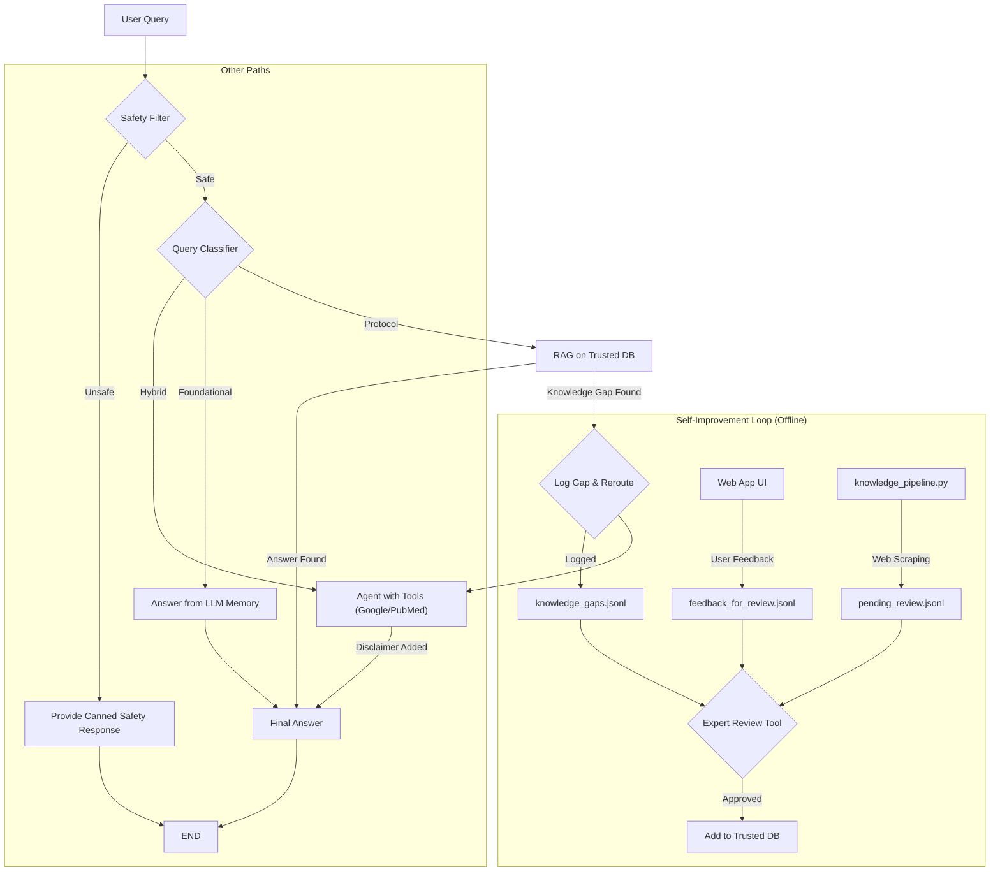

# rmk-langgraph

# Adaptive Medical Hybrid RAG Agent

A smart, self-improving AI for Weight Management & Body Composition, built with LangGraph and Gemini.

This project implements an adaptive Retrieval Augmented Generation (RAG) system for answering questions related to weight management and health. It now features a hybrid retrieval approach, leveraging both semantic vector search (via ChromaDB) and structured knowledge graph querying (via Neo4j) to provide comprehensive and contextually relevant answers.

The system is designed for the high-stakes domain of medical knowledge, specifically focusing on obesity, weight loss, and muscle gain. It includes a multi-layered self-improvement loop with human-in-the-loop verification to ensure the knowledge base remains accurate, safe, and up-to-date.

## Core Features

-   **Adaptive RAG Architecture:** Built with LangGraph, the agent classifies queries into `foundational`, `protocol`, or `hybrid` and uses the best strategy for each. This includes hybrid retrieval from vector and graph databases for `protocol` queries.
-   **Multi-Tool Capability:** The agent can choose between using Google Search for general or recent topics and a specialized PubMed API tool for deep scientific research.
-   **Human-in-the-Loop Self-Improvement:** The system learns from both user feedback and a semi-automated knowledge pipeline, but a human expert provides the final approval before new knowledge is added to the trusted database.
-   **Safety First:** Includes a safety filter to identify and block harmful queries, providing a safe user experience.
-   **Configurable & Maintainable:** Key settings like the LLM model name are managed in a `.env` file, allowing for easy experimentation and upgrades.

### Knowledge Sources

*   **Vector Store (ChromaDB):** Stores text chunks from ingested PDF documents, enabling semantic search for relevant passages.
*   **Knowledge Graph (Neo4j):** Stores entities (like conditions, treatments, concepts) and their relationships extracted from the documents. This allows the system to retrieve interconnected information and understand the context more deeply, particularly for queries requiring factual, structured data (e.g., via the "protocol" query pathway).

## Architecture & Workflow

The application's logic is orchestrated by a LangGraph state machine, which provides a clear, robust, and adaptable workflow.



## Tech Stack

-   **Orchestration:** LangChain & LangGraph
-   **LLM:** Google Gemini (configurable)
-   **Frontend:** Streamlit
-   **Vector Database:** ChromaDB
-   **Embeddings:** HuggingFace Sentence Transformers (`all-MiniLM-L6-v2`)
-   **Medical Search:** BioPython (for Entrez/PubMed API)

---

## Neo4j Setup

This project uses Neo4j as a graph database for knowledge representation in the RAG pipeline.

### Docker (Recommended for Local Development)

1.  Pull the Neo4j Docker image:
    ```bash
    docker pull neo4j:latest
    ```
2.  Run the Neo4j container:
    ```bash
    docker run \
        --name neo4j-container \
        -p 7474:7474 -p 7687:7687 \
        -d \
        --env NEO4J_AUTH=neo4j/your_password \
        neo4j:latest
    ```
    Replace `your_password` with a secure password. This will be the password you set in your `.env` file for `NEO4J_PASSWORD`.
3.  Access the Neo4j Browser at `http://localhost:7474` and log in with username `neo4j` and the password you set.

### Neo4j AuraDB (Cloud Option)

Alternatively, you can use [Neo4j AuraDB](https://neo4j.com/cloud/platform/auradb/), Neo4j's fully managed cloud database service.

1.  Create a free instance on AuraDB.
2.  Once your instance is running, find the connection URI (usually starting with `neo4j+s://`) and credentials.
3.  Update your `.env` file with these details:
    ```
    NEO4J_URI=your_auradb_uri
    NEO4J_USERNAME=your_auradb_username
    NEO4J_PASSWORD=your_auradb_password
    ```

Remember to create an `.env` file from `.env.example` and fill in your specific Neo4j credentials.

---

## How-To Guide: Setup and Usage

Follow these steps to get the application running on your local machine.

### 1. Prerequisites

-   Python 3.9+
-   Git

### 2. Installation

**1. Clone the repository:**
```bash
git clone https://github.com/YOUR_USERNAME/YOUR_REPOSITORY_NAME.git
cd YOUR_REPOSITORY_NAME
```

**2. Create a virtual environment (recommended):**
```bash
# For macOS/Linux
python3 -m venv venv
source venv/bin/activate

# For Windows
python -m venv venv
.\venv\Scripts\activate
```

**3. Install dependencies:**
```bash
pip install -r requirements.txt
```

### 3. Configuration

**1. Create your environment file:**
Copy the example file to create your own local configuration.
```bash
cp .env.example .env
```

**2. Edit the `.env` file:**
Open the newly created `.env` file with a text editor and fill in your actual credentials for `GOOGLE_API_KEY`, `ENTREZ_EMAIL`, and `ENTREZ_API_KEY`. You can also change the `LLM_MODEL` if you wish. Remember to also set your `NEO4J_URI`, `NEO4J_USERNAME`, and `NEO4J_PASSWORD` if you are using Neo4j.

### 4. Knowledge Base Ingestion (Mandatory First Step)

Before you can run the main application, you must build the trusted knowledge base, which populates both ChromaDB and Neo4j.

**1. Add your documents:**
Place your trusted PDF files (medical textbooks, guidelines, etc.) inside the `data/` directory.

**2. Run the ingestion script (`ingest.py`):**
Execute the following command in your terminal.
```bash
python ingest.py
```
The `ingest.py` script processes PDF documents from the `data/` directory. During ingestion:
1.  Text is extracted and split into manageable chunks.
2.  These chunks are embedded and stored in ChromaDB for vector search.
3.  Entities and relationships are extracted from the chunks using a Language Model and stored as a graph in Neo4j. This populates the knowledge graph used in the hybrid RAG process.
The script keeps track of processed files to enable incremental updates.


### 5. Running the Application

Once ingestion is complete, you can start the web application.

```bash
streamlit run app.py
```

Open your web browser and navigate to the local URL provided by Streamlit (usually `http://localhost:8501`).

## Usage & The Self-Improvement Loop

The project consists of three main parts that work together.

#### 1. The Main Web App (`app.py`)

This is the primary user interface. You can chat with the AI, and it will use its adaptive logic to answer your questions. After an answer is generated, you can provide feedback using the "👍 Good" or "👎 Bad" buttons. This feedback is crucial for the self-improvement loop.

#### 2. The Automated Knowledge Pipeline (`knowledge_pipeline.py`)

This script is designed to be run on a schedule (e.g., as a daily cron job). It automatically:
-   Scans a list of trusted websites for new content.
-   Uses the LLM to read new articles and propose new knowledge in a Q&A format.
-   Saves these "propositions" to a file (`pending_review.jsonl`) for an expert to review.

To run it manually:
```bash
python knowledge_pipeline.py
```

#### 3. The Expert Review Tool (`expert_review_tool.py`)

This is the command-line tool for the human expert. It's the quality gate for all new knowledge. When you run this script, it will:
1.  First, present you with the new knowledge propositions from the automated pipeline.
2.  Second, present you with the "Good" Q&A pairs submitted by users via the web app's feedback buttons.

For each item, you can review the content and its source, then choose to **[a]pprove** it to be added to the trusted knowledge base or **[s]kip** it.

To run the review tool:
```bash
python expert_review_tool.py
```

By regularly running the pipeline and the review tool, you continuously improve the AI's core knowledge, making it smarter, more accurate, and more useful over time.

---

## License

This project is licensed under the MIT License. See the `LICENSE` file for details.
